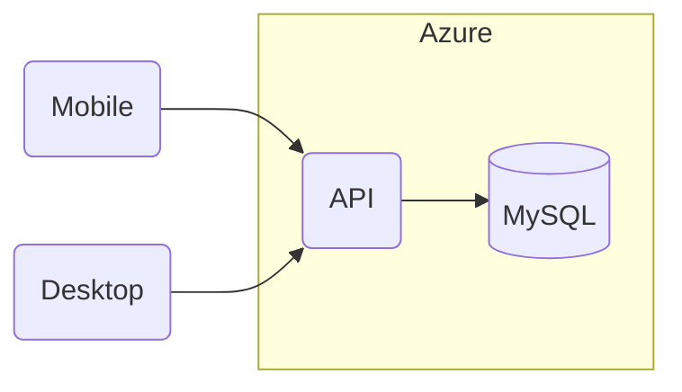
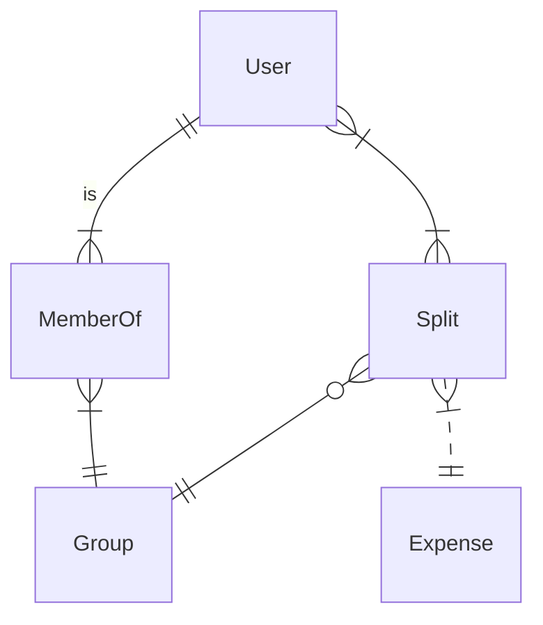

# ExpenseWise

A tool for tracking expenses and balances on a group level for varied occasions. ExpenseWise makes it easy to calculate totals by keeping an informal ledger that can be updated on an as needed basis. 

## Dependencies

- [MediatR](https://github.com/jbogard/MediatR/)
- [AutoMapper](https://docs.automapper.org/en/stable/Getting-started.html)
- [FluentValidation](https://docs.fluentvalidation.net/en/latest/)
- [Moq](https://github.com/devlooped/moq)
- [EntityFramework Core](https://learn.microsoft.com/en-us/ef/core/get-started/overview/first-app?tabs=netcore-cli)
- [Dapper](https://github.com/DapperLib/Dapper/)
- [Docker](https://www.docker.com/support/)

## High Level Design 
### Infrastructure

### Entity Relationship Diagram

