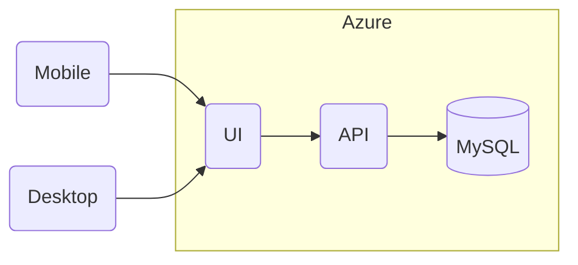
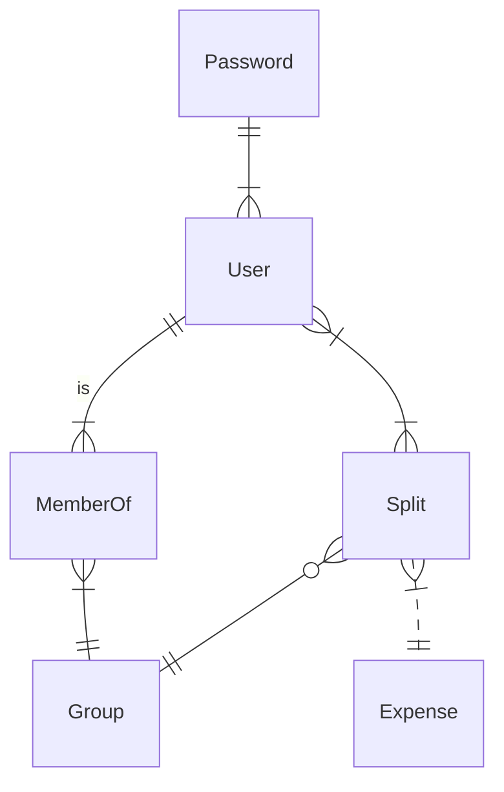

# ExpenseWise

A tool for tracking expenses and balances on a group level for varied occasions. ExpenseWise makes it easy to calculate totals by keeping an informal ledger that can be updated on an as needed basis.

## Install

### Clone repo into your machine

### Docker Commands

- `docker compose build --no-cache`
- `docker compose up`
- `docker compose down`

## Run in Docker

Recommended commands to build and run the API, UI, and database together:

- Build and start in detached mode:

```bash
docker compose up --build -d
```

- Follow logs for all services:

```bash
docker compose logs -f
```

- Stop and remove containers, networks and volumes:

```bash
docker compose down --volumes
```

- Optional: set custom ports or DB env vars before running:

```bash
export API_PORT=8081 UI_PORT=8080 DB_PASSWORD=secret DB_DATABASE=expensewise DB_USERNAME=expense
docker compose up --build -d
```

## Dependencies

- [MediatR](https://github.com/jbogard/MediatR/)
- [AutoMapper](https://docs.automapper.org/en/stable/Getting-started.html)
- [FluentValidation](https://docs.fluentvalidation.net/en/latest/)
- [Moq](https://github.com/devlooped/moq)
- [Entity Framework Core](https://learn.microsoft.com/en-us/ef/core/)
- [Dapper](https://github.com/DapperLib/Dapper/)
- [Docker](https://www.docker.com/support/)

## High Level Design

### Infrastructure


```mermaid
flowchart LR;
   id2(Mobile) --> id3(UI);
   id1(Desktop) --> id3(UI);
   
   subgraph Azure
    id3(UI) --> id4(API)
    id4(API) --> A@{ shape: cyl, label: "MySQL" };
   end
```

### Entity Relationship Diagram


```mermaid
erDiagram
   User ||--|{ MemberOf : is
   Password ||--|{ User : ""
   MemberOf }|--|| Group : ""
   Split }o--|| Group : ""
   User }|--|{ Split : ""
   Split }|..|| Expense : ""
```
