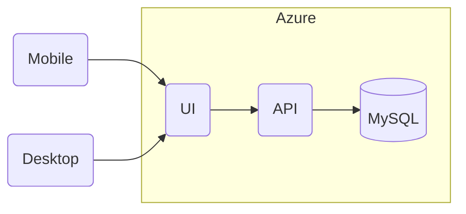
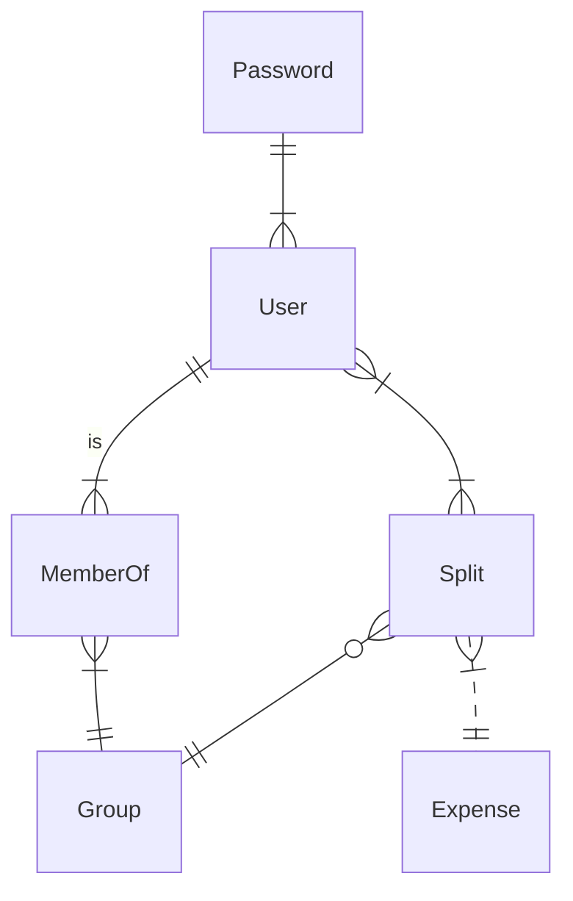

# ExpenseWise

A tool for tracking expenses and balances on a group level for varied occasions. ExpenseWise makes it easy to calculate totals by keeping an informal ledger that can be updated on an as needed basis.

## Dependencies

- [MediatR](https://github.com/jbogard/MediatR/)
- [AutoMapper](https://docs.automapper.org/en/stable/Getting-started.html)
- [FluentValidation](https://docs.fluentvalidation.net/en/latest/)
- [Moq](https://github.com/devlooped/moq)
- [Entity Framework Core](https://learn.microsoft.com/en-us/ef/core/)
- [Dapper](https://github.com/DapperLib/Dapper/)
- [Docker](https://www.docker.com/support/)

## High Level Design

### Infrastructure


```mermaid
flowchart LR;
   id2(Mobile) --> id3(UI);
   id1(Desktop) --> id3(UI);
   
   subgraph Azure
    id3(UI) --> id4(API)
    id4(API) --> A@{ shape: cyl, label: "MySQL" };
   end
```

### Entity Relationship Diagram


```mermaid
erDiagram
   User ||--|{ MemberOf : is
   Password ||--|{ User : ""
   MemberOf }|--|| Group : ""
   Split }o--|| Group : ""
   User }|--|{ Split : ""
   Split }|..|| Expense : ""
```

## Developer Guide

A concise guide to get new developers up to speed with the codebase.

- **Quick Start:** Build and run the API, UI and DB together using Docker.

```bash
export API_PORT=8081 UI_PORT=8080 DB_PASSWORD=secret DB_DATABASE=expensewise DB_USERNAME=expense
docker compose up --build -d
docker compose logs -f
```

- **Prerequisites:**
   - .NET SDK (recommended version: see global.json or the project files)
   - Docker & Docker Compose
   - Optional: a MySQL client for inspecting the DB
   - Environment variables: `API_PORT`, `UI_PORT`, `DB_USERNAME`, `DB_PASSWORD`, `DB_DATABASE`, `FORWARD_DB_PORT`

- **Run Locally (without Docker):**
   - Set the required env vars, then run the Presentation projects:

```bash
dotnet build
cd Presentation/Api
dotnet run
```

- **Project Structure (high level):**
   - `Application/` — Use cases, request validators, MediatR handlers
   - `Core/` — Domain entities and value objects
   - `Infrastructure/` — Database adapters, EF/Dapper, generated OpenAPI client
   - `Presentation/` — API and UI entrypoints and controllers
   - `Tests/` — Unit and integration tests

- **Architecture & Patterns:**
   - CQRS/MediatR for application flows
   - FluentValidation for request validation
   - EF Core and Dapper for data access
   - AutoMapper for mapping DTOs

- **Build & Test:**

```bash
dotnet build ExpenseWise.sln
dotnet test --no-build
```

- **Contributing:**
   - Use feature branches and open PRs against `main`/`develop` (project convention-dependent).
   - Run tests locally before submitting a PR.

- **Troubleshooting:**
   - If migrations or DB issues occur, inspect the `Infrastructure/SqlDatabase/Migrations` folder and the container logs.
   - Use `docker compose logs <service>` to view specific service output.

- **References & Contacts:**
   - API startup: [Presentation/Api/Program.cs](Presentation/Api/Program.cs)
   - UI startup: [Presentation/UI/Program.cs](Presentation/UI/Program.cs)
   - Application entrypoints: [Application/UseCases/UseCases.csproj](Application/UseCases/UseCases.csproj)
